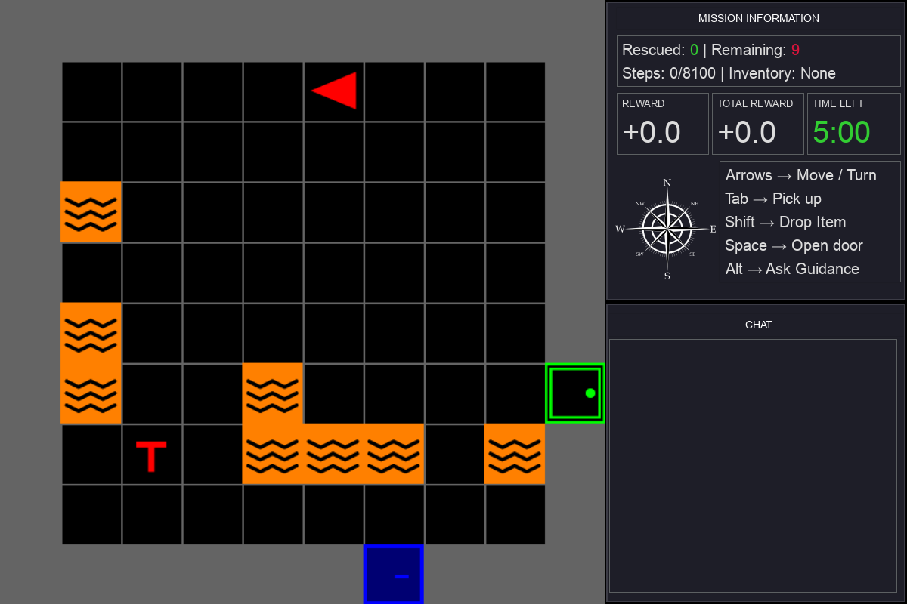
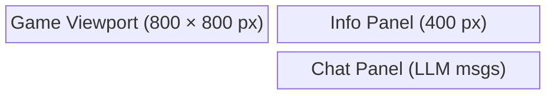

# GUI



## Main window (`SAREnvGUI`) — `src/mosaic/gui/main.py`

The top-level Pygame controller. Layout:



- 30 FPS rendering loop
- `F11` toggles fullscreen with dynamic UI scaling
- `pygame_gui` used for all UI widgets

Every major component is constructor-injectable — `llm_client`, `prompt_builder`,
`response_processor`, `user`, `info_panel`, `chat_panel`, and `vignette` all default to the
neutral `mosaic` implementations but can be swapped by passing already-built instances:

```python
gui = SAREnvGUI(
    env,
    config={"fullscreen": False},
    llm_client=my_llm_client,
    vignette=EdgeVignette(game_size, styles=custom_styles),
)
```

A fullscreen toggle only rebinds `info_panel`/`chat_panel` to a fresh `UIManager`; it does not
recreate `user`, `vignette`, or the panels themselves, so external references to those instances
survive a toggle.

## InfoPanel — `src/mosaic/gui/info.py`

Displays mission-critical information on the right panel:

- **Mission Status** header (victims saved / remaining)
- **Metrics:** cumulative reward, step count, elapsed time
- **Object Table:** lists all game objects in range with type, color, location, visibility
  (in current camera view or not), reachability (BFS distance, or blocked), and whether a tool
  (key) is required
- **Compass:** cardinal direction indicator for agent facing
- **Controls legend:** key bindings reminder

## ChatPanel — `src/mosaic/gui/chat.py`

Displays messages from the LLM assistant:

- New messages cause a **blinking highlight** effect
- Message colors: agent suggestions in cornflower blue, errors in crimson
- Polls for async LLM responses each frame

## Edge vignette feedback — `src/mosaic/gui/feedback.py`

`EdgeVignette` renders a configurable screen-edge glow in response to game events (e.g. taking
damage, nearing a hazard). It's triggered from `SAREnvGUI` via `user.on_step` and is injected
into `SAREnvGUI` like any other component, so its colors/behavior can be overridden per study.

## User input (`User`) — `src/mosaic/gui/user.py`

Handles all keyboard input and dispatches:

- Movement and interaction actions to `env.step()`
- LLM queries on `Alt` key (runs in a background thread to avoid frame drops)
- Episode reset on `Backspace`
